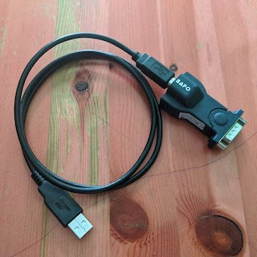

# Wireless Console Server

Sebagai _network engineer_ pastinya anda mengenal kabel _console_ untuk melakukan konfigurasi. Kabel yang salah satu ujungnya mempunyai konektor DB9 _female_ dan satunya lagi bisa berupa RJ45 atau DB9 _male_ maupun _female_. Ini kabel wajib dipunyai oleh _network engineer_, biasanya disandingkan dengan kabel _usb2serial_ baik keluaran Bafo atau Aten.




Kadang-kadang saya tidak suka duduk dengan waktu yang lama di depan perangkat untuk melakukan konfigurasi. Saya lebih suka melakukannya di tempat yang nyaman dan penuh dengan cemilan. Ada beberapa _gadget_ yang bisa mengakomodasi kebutuhan ini, misalnya Airconsole, dengan harga yang cukup mahal. Harga yang cukup mahal ini membuat saya mencari alternatif lain yang akhirnya jatuh ke _mini router_ yang mendukung OpenWRT.

**Catatan**: tutorial ini tidak akan menjelaskan instalasi OpenWRT di _mini router_


## Koneksi

Beberapa model _switch_ atau _router_ mempunyai _port_ USB, _power_ dari _port_ ini dapat digunakan untuk menghidupkan _mini router_ dan _port_ USB dari _mini router_ dikoneksikan ke kabel _usb2serial_ dan kabel _console. Apabila tidak ada _port_ USB, maka _power bank_ dapat digunakan untuk menghidupkan _mini router_.


## _Hardware_

Pada awalnya pilihan saya jatuh ke TP-Link MR3020, tapi sejak versi _hardware_ 3.0 (pada saat itu OpenWRT belum mendukung) saya memilih GL.inet AR150. Saat ini OpenWRT sudah mendukung MR3020 versi 3.0, tapi sudah tidak dikembangkan lagi dengan _build_ terakhir versi [19.07][1]. Bila anda tidak peduli dengan versi terakhir, MR3020 bisa digunakan sebagai pilihan karena lebih murah dibanding GL.inet.


Pilihan lain adalah GL.inet AR150, _mini router_ ini menjadi favorit saya karena selain sudah menggunakan OpenWRT terdapat 2 _port ethernet_ untuk LAN dan WAN. Sangat berguna apabila membutuhkan akses ke LAN dan WAN sekaligus.


## _Software_

_Package_ [**ser2net**][2] digunakan untuk memfungsikan OpenWRT ini sebagai _console server_. ser2net membuat _port serial_ dapat diakses melalui jaringan IP. _Port serial_ ini diakses menggunakan koneksi _wireless_ maupun _wired_, sesuai dengan tujuan di awal tentu saja koneksi _wireless_ yang dipilih.


Selain _package_ **ser2net**, _driver_ untuk kabel _usb-to-serial_ harus di-_install_ juga. _Driver_ yang perlu di-_install_ tergantung dari _chipset_ kabel yang digunakan. Beberapa contoh yang bisa saya berikan ada di bawah.
1. kmod-usb-acm, untuk Cisco mini USB (kabel mini USB biasa)
2. kmod-usb-serial-ftdi, untuk _usb2serial_ dengan _chipset_ FTDI
3. kmod-usb-serial-pl2303, untuk _usb2serial_ dengan _chipset_ PL2303

Untuk mengecek apakah kabel sudah dikenali bisa dilakukan melalui OpenWRT dan jalankan perintah:

ls /dev/tty*

Apabila muncul baris seperti _ttyACM0_, _ttyUSB0_, atau _ttyATH0_, maka kabel sudah dikenali oleh OpenWRT.


## Konfigurasi

Konfigurasi dilakukan di _file_ **/etc/ser2net.conf**, silakan gunakan _editor_ favorit masing-masing. Contoh dari konfigurasi ser2net dapat dilihat di bawah.

```BANNER:banner1:wireless console server port \p device \d \s \r\n
2001:telnet:0:/dev/ttyUSB0:9600 1STOPBIT 8DATABITS banner1
2002:telnet:0:/dev/ttyACM0:9600 1STOPBIT 8DATABITS banner1
2003:telnet:0:/dev/ttyATH0:9600 1STOPBIT 8DATABITS banner1
```

**BANNER** = digunakan untuk menampilkan pesan ketika terhubung ke console dengan nama `banner1`

**2001** = _port_

**/dev/ttyXXXY** = _port serial_, bisa dicek dengan perintah `ls /dev/tty*`

**9600** = _baud rate_

Untuk menjalankan ser2net setiap kali _booting mini router_, _edit file_ `/etc/rc.local` dan tambahkan `ser2net` di baris sebelum `exit 0`.

Tes konfigurasi dengan menghubungkan _laptop_/PC ke ssid `OpenWRT` dan lakukan perintah berikut di terminal, dengan contoh IP OpenWRT 192.168.1.1 dan port 2000.

`telnet 192.168.1.1 2000`

Bisa juga menggunakan PuTTY atau aplikasi favorit masing-masing.


[1]: https://openwrt.org/toh/tp-link/tl-mr3020
[2]: https://github.com/cminyard/ser2net
